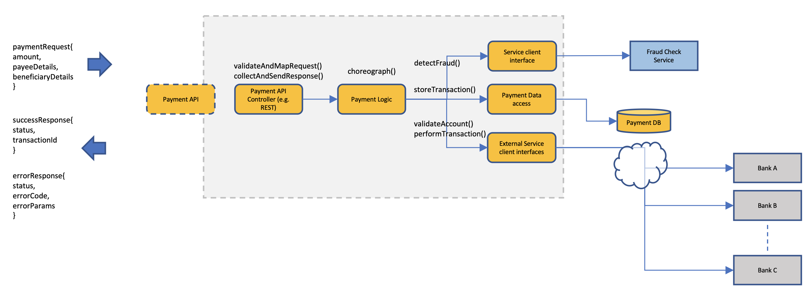
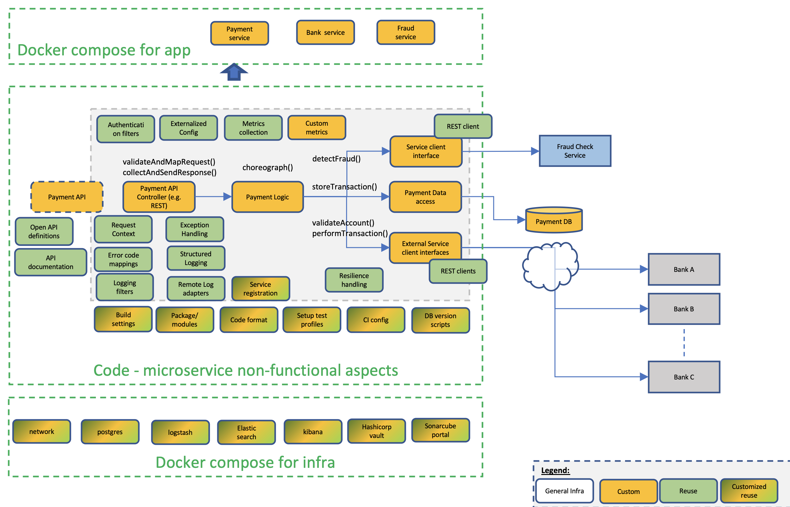

## Architecture
This repository contains Payment Service (the main reference service). It has following use-cases:

* Saves payment transaction info to Postgres DB
* Looks up url for BankService per bank
* Interacts(make calls) with two external (mocked) services BankService and FraudService. Both services can be bootstrapped via `docker-compose` and source can be found at `demo-bank-fraud-service`

### What's in the box?
* The starter-kit contains the source code for the central green box named "code - microservice non-functional aspects". 

* The starter-kit also contains a tools/demo folder which has the docker-compose ymls for the docker compose setup indicated in the diagram below.

* PostgresDB is a basic service which runs with main service.

* Dependency service instance to represent the Fraud-check service in the diagram is provided by the FraudService container in the docker compose of `demo-bank-fraud-service`

* Dependency Service instances to represent Bank A, B and so on in the diagram is provided by the BankService container in the docker compose of `demo-bank-fraud-service`. By default the docker-compose runs only one instance of this. You can run more instances by mapping it to different ports if you want to simulate many banks

To verify, if bankinfo is seeded properly.
Make the GET request in POSTMAN with following url:
**http://localhost:8080/bankinfo**

**The service along with service dependencies is now built and running fine in your setup. Explore, reference and reuse!!!**

* Check the database you have configured. There will be 2 new empty tables – bankInfo and payment. Check and confirm the same

- In postman or browser GET http://localhost:8082/checkDetails?accountNumber=12345&ifscCode=HDFC1234
  - This should return 200 response with empty body

*NOTE: BankService is the service that will validate the accounts before payment. Any account-IfscCode combination that you will give in the payment request (json sample given above) should be in the "BankService" database. By default the docker instance comes with two accounts 12345-HDFC1234 and 67890-HDFC1234. Any new accounts you need are to be added by posting to BankService as follows (TBD)*

### User API
- This api stores user details like password in hashed format and sensitive details like txn_id in encrypted format while saving in db. 
- Decryption/Encryption of sensitive information happens at application level
- Set symmetric KEY with 256 or 128 bit as env variable (we are using AES currently ) either on terminal or set in .env file.

At the minimum, you need to have the postgres database, BankService and FraudService running for payment service to be successfully working.

 Additionally, you can set up and configure components such as centralized logging, config, metrics etc. All these components can be configured from `dev-infra` or local docker compose files.